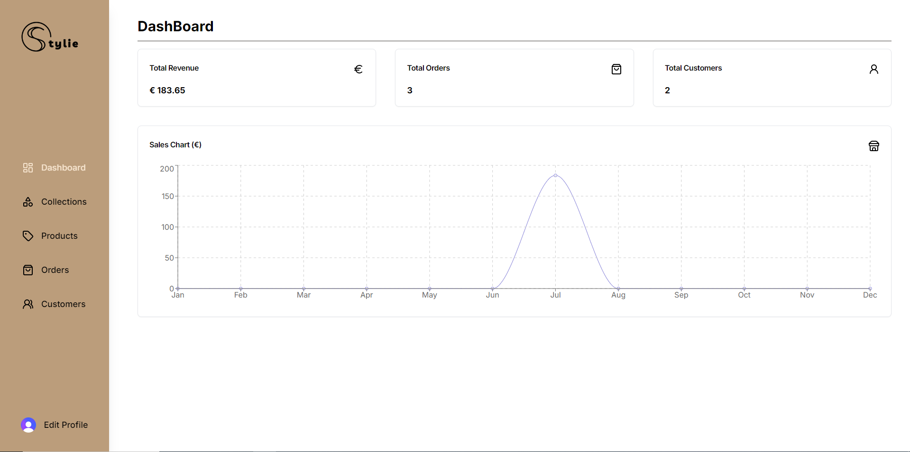
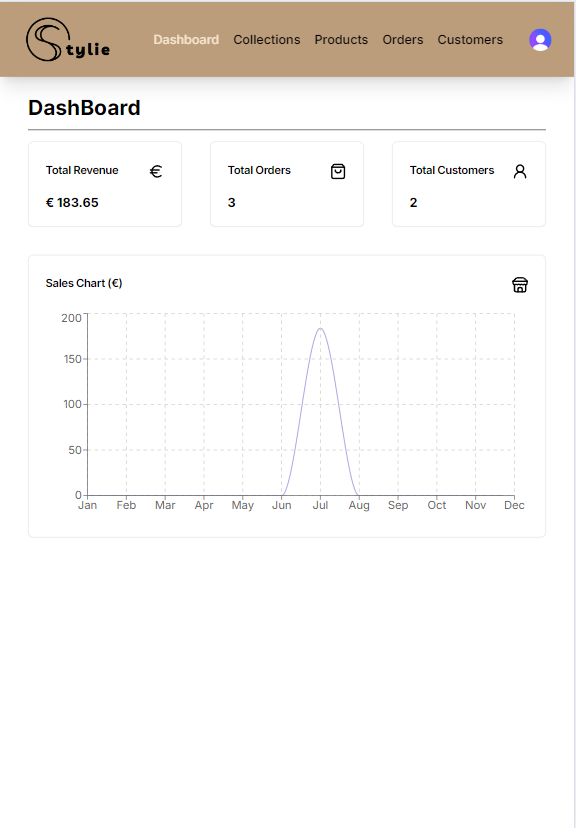
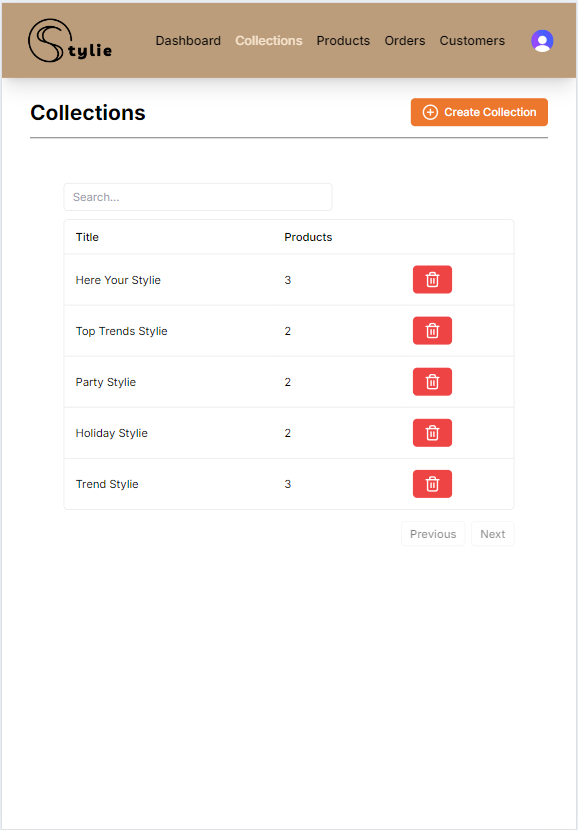
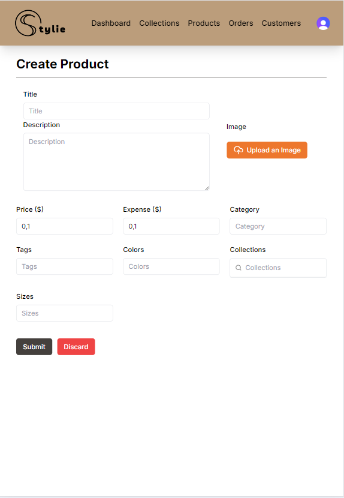
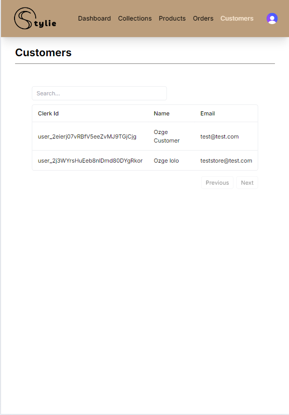
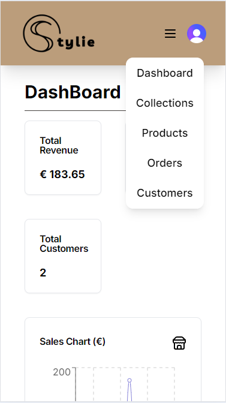
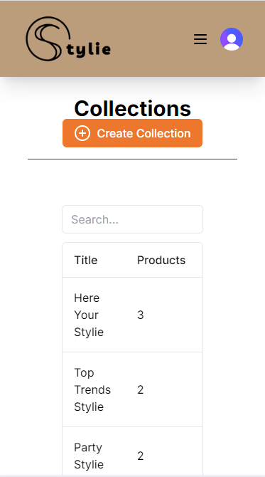

## Ecommerce Admin Panel

[visit demo](https://ecommerce-admin-henna-phi.vercel.app/)

> ### Admin Information
> Email: test@test.com <br/>
> Password: stylie2024

## Description
A comprehensive admin dashboard built with Next.js and TypeScript for managing a clothing store. Sellers can add products and collections, specify product features, and upload images using Cloudinary. The project integrates Stripe for payment processing and Clerk for user authentication.


## Table of Contents
- [Description](#description)
- [Features](#features)
- [Gallery](#gallery)
- [Installation](#installation)
- [Usage](#usage)
- [Technologies](#technologies)

## Features

- **User Authentication**: Secure authentication using Clerk.
- **Payment Processing**: Integrated with Stripe for handling payments.
- **Data Management**: Efficient data handling with MongoDB.
- **Modern UI**: Sleek and responsive user interface with Next.js and TypeScript.
- **Real-time Updates**: Real-time data updates and notifications.
- **Product Management**: Sellers can add and manage products and collections.
- **Image Handling**: Image uploads and management using Cloudinary.

## Gallery



### Medium Screens





### Small Screens



## Installation
Instructions for setting up the project locally.

```bash
# Clone the repository
git clone https://github.com/ozgevurmaz/ecommerce-admin.git

# Navigate to the project directory
cd ecommerce-admin

# Install dependencies
npm install

# Set up environment variables
# Create a .env.local file and add your environment variables as shown in the .env.example file

# Run the development server
npm run dev
```

## Usage
# Access the development server at
http://localhost:3000

# For production build
npm run build
npm start

## Technologies
- **Frontend**: Next.js, TypeScript
- **Backend**: Node.js, MongoDB
- **Authentication**: Clerk
- **Payments**: Stripe
- **Image Handling**: Cloudinary
